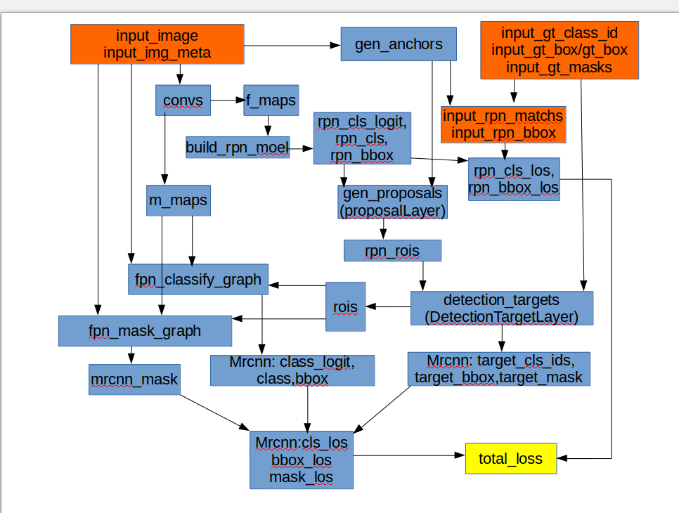

# Mask-rcnn
The original code is here. [Mask-rcnn](https://github.com/matterport/Mask_RCNN)
# paper
MobileNetV2: Inverted Residuals and Linear Bottlenecks

Mask R-CNN, Kaiming He
# mask-rcnn coding models

